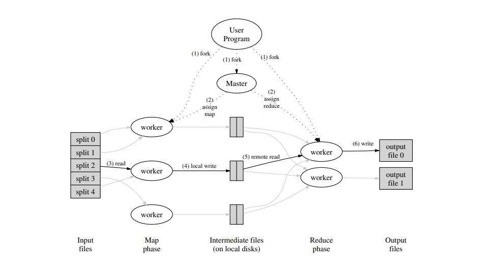
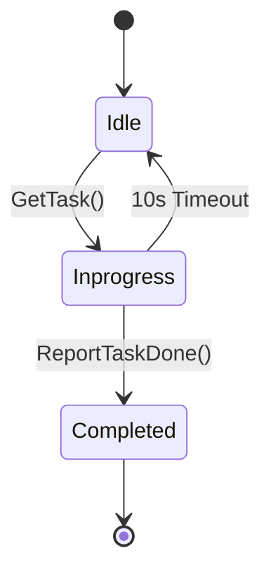

# mapreduce-go

A complete implementation of the [Google MapReduce](https://pdos.csail.mit.edu/6.824/papers/mapreduce.pdf) framework in Go. Pure net/rpc, no frameworks, no shortcuts.

## Why MapReduce

MapReduce was designed to solve a problem most frameworks overcomplicate: processing terabytes of data across hundreds of machines while hiding the complexity of distribution, fault tolerance, and data movement. The core philosophy is simple: move the computation to the data, not the data to the computation. By partitioning work into independent `Map` and `Reduce` phases, the system achieves massive parallelism and resilience. `mapreduce-go` implements this model from the ground up, focusing on the coordinator-worker dance and the mechanics of intermediate file management.

## Architecture



Two primary components communicating via Go's `net/rpc` over Unix domain sockets:

### Coordinator

The central orchestrator. It doesn't process data; it manages the state of the world. The coordinator tracks every Map and Reduce task across three states: `Idle`, `Inprogress`, and `Completed`.

The coordinator's primary responsibility is task scheduling. It hands out Map tasks first (one per input file). Only after *every* Map task has successfully completed does it transition to the Reduce phase. This barrier is critical because a Reduce task requires the intermediate output from every single Map task to be complete.

Fault tolerance is baked into the coordinator. It runs a `TimeoutMonitor` for every assigned task. If a worker doesn't report success within 10 seconds, the coordinator assumes the worker has crashed or stalled, resets the task to `Idle`, and makes it available for another worker.

### Workers

The workhorses. A worker process runs a continuous loop: ask the coordinator for a task, execute it, report back. Workers are stateless; they don't know the "big picture," only the specific chunk of data they are currently processing.

- **Map Workers**: Read an input file, apply the user-defined `Map` function, and partition the output into `NReduce` buckets using a hash of the key (`ihash(key) % NReduce`).
- **Reduce Workers**: Collect intermediate files for their specific partition (e.g., all `mr-*-7` files for Reduce task 7), sort the keys to group values, and apply the user-defined `Reduce` function.

## Protocol

Communication uses standard Go RPC. The `mr/rpc.go` defines the interface between the worker and coordinator.

### Task Request

Workers identify themselves and request the next available piece of work:

```go
type GetTaskArgs struct {
    WorkerID int
}

type GetTaskReply struct {
    TaskType string // "map", "reduce", "wait", or "exit"
    TaskID   int
    File     string
    NReduce  int
    NMap     int
}
```

### Reporting Completion

Once a task is finished, the worker reports back. The coordinator then marks the task as `Completed`, which might trigger the phase transition (from Map to Reduce) or the final shutdown.

```go
type ReportTaskDoneArgs struct {
    TaskType string
    TaskID   int
    File     string
}
```

## Map Phase

The Map phase is the first stage of the pipeline. Each input file is treated as a single Map task.

1.  **Read**: The worker reads the entire contents of the input file.
2.  **Map**: The user-provided `Map` function is called, emitting a list of `KeyValue` pairs.
3.  **Partition**: These pairs are partitioned into `NReduce` buckets.
4.  **Write**: Intermediate data is written to files named `mr-X-Y`, where `X` is the Map task ID and `Y` is the Reduce partition ID.

To ensure crash safety, workers write to temporary files first:

```go
// Write to a temp file, then atomically rename (crash safety).
tmpFile, err := os.CreateTemp(".", "mr-tmp-*")
if err != nil {
    log.Println("CreateTemp:", err)
    continue
}
enc := json.NewEncoder(tmpFile)
for _, kv := range kvs {
    enc.Encode(&kv)
}
tmpFile.Close()
os.Rename(tmpFile.Name(), finalName)
```

## Reduce Phase

The Reduce phase begins only after the coordinator confirms all Map tasks are done. Each Reduce task handles one partition across all Map outputs.

1.  **Collect**: The worker gathers all `mr-*-Y` files for its assigned partition `Y`.
2.  **Sort**: All key-value pairs are sorted by key. This is essential for the `Reduce` function to process all values for a given key in one go.
3.  **Reduce**: The worker iterates through the sorted keys, calling the user-provided `Reduce` function for each unique key and its associated list of values.
4.  **Output**: Final results are written to `mr-out-Y`.

## Fault Tolerance

Workers are expected to fail. The system handles this through two mechanisms:

### Timeout Monitoring

The coordinator tracks the "StartTime" of every task assigned to a worker.

```go
func (c *Coordinator) TimeoutMonitor(task *TaskMetadata) {
	time.Sleep(10 * time.Second)
	c.mu.Lock()
	defer c.mu.Unlock()
	if task.Status == Inprogress {
		task.Status = Idle // Re-queue the task
	}
}
```

If a worker disappears, the task simply reverts to `Idle` and will be picked up by the next available worker. This handles both worker crashes and "stragglers" (workers that are alive but extremely slow).

### Atomic Renames

If a worker crashes halfway through writing a file, we don't want a partial file to corrupt the Reduce phase. By writing to a temporary file (e.g., `mr-tmp-123`) and using `os.Rename` only when the write is complete, we guarantee that the final file (`mr-1-0`) is either fully written or doesn't exist at all.

## Task Lifecycle

The coordinator maintains a state machine for every task:



- **Idle**: Ready to be assigned.
- **Inprogress**: Assigned to a worker, being monitored for timeout.
- **Completed**: Successfully finished, results are on disk.

## Usage

### 1. Build

```bash
go build -o coordinator ./cmd/coordinator
go build -o worker ./cmd/worker
```

### 2. Run Word Count

Start the coordinator with a set of input files:

```bash
./coordinator /tmp/mr-sock testdata/pg-*.txt
```

In other terminals, start one or more workers:

```bash
./worker --app wc /tmp/mr-sock
```

### 3. Automated Testing

Run the end-to-end test script to verify word count across multiple workers:

```bash
bash scripts/test_wc.sh 5
```

## What's in the Box

A production-style MapReduce implementation focusing on the core distributed primitives:

| Feature | Details |
|---------|---------|
| **Coordinator** | Central task tracker, phase management (Map -> Reduce transition) |
| **Worker** | Continuous polling loop, stateless execution, Map/Reduce logic |
| **Fault Tolerance** | 10s timeout monitoring, task re-assignment on failure |
| **Crash Safety** | Atomic `os.Rename` for intermediate and final outputs |
| **Communication** | net/rpc over Unix domain sockets |
| **Partitioning** | Deterministic hash-based partitioning (`ihash`) |
| **Intermediate Files** | JSON-encoded key-value pairs (`mr-mapID-reduceID`) |
| **Example Apps** | Word Count (`wc.go`), Inverted Index (`indexer.go`) |

## References

- [MapReduce: Simplified Data Processing on Large Clusters (2004)](https://pdos.csail.mit.edu/6.824/papers/mapreduce.pdf) — Dean and Ghemawat
- [MIT 6.824: Distributed Systems](https://pdos.csail.mit.edu/6.824/) — The inspiration for this implementation.
